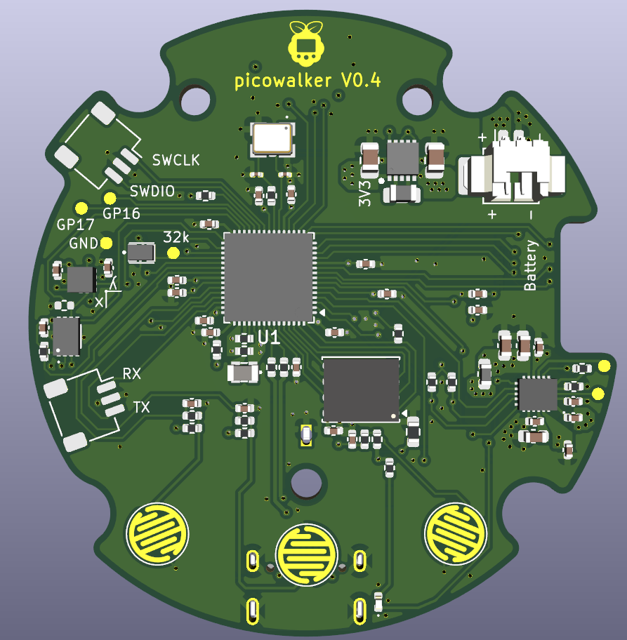
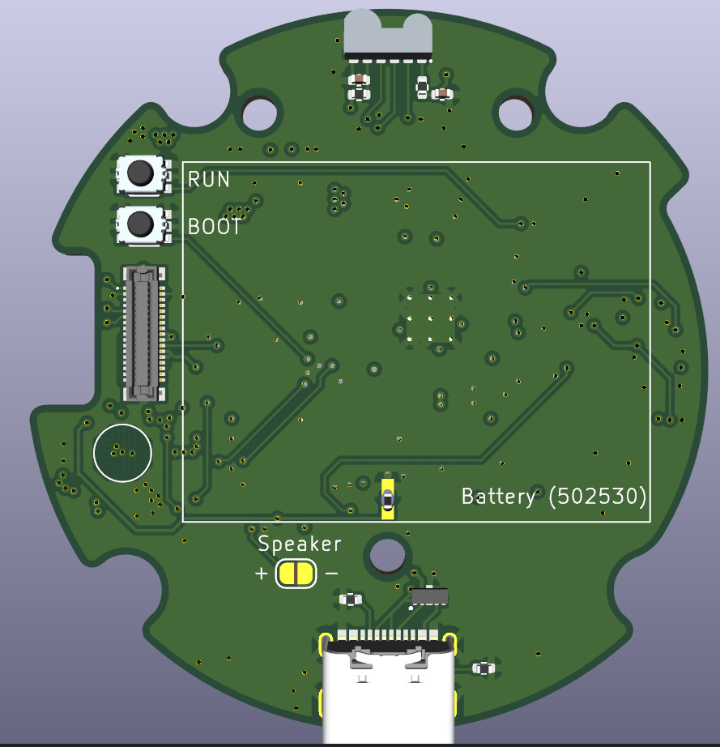

# picowalker hardware

This is the PCB hardware side of the [picowalker](https://github.com/mamba2410/picowalker) project.
The goal of the picowalker project is to create a new, modern equivalent to the Pokewalker distributed with the Pokemon HeartGold and SoulSilver games back in 2010.
Since those units are no longer sold and are getting harder and harder to obtain, creating a new version sounds like the easiest option. And the most fun.

The hardware is designed around the RP2350 chip. STM32U5 versions have been considered for longer battery life, but they're more expensive and I'm worried about availability (and the name "picowalker" wouldn't work!)

Software for this can be found in the [picowalker](https://github.com/mamba2410/picowalker/) and [picowalker-core](https://github.com/mamba2410/picowalker-core/) repos.

## Features

- RP2350A as the main microcontroller.
- 1.8" AMOLED screen DO0180FMST03, 448x368 resolution (running at 384x256 for 4x upscaling) driven by PIO'd QSPI (output only).
- Rechargeable lithum battery via USB-C using the BQ25628E PMIC.
- Larger form factor to accommodate larger screen and battery.
- Custom shell based on the original Pokewalker designed by Kamp.
- IrDA driven by PIO courtesy of Dmitry gr's PIO code.
- 64kB EEPROM using the M95512 chip (same as in the original walker).
- Code and extra image flash using 16MB W25Q128.
- Accelerometer with BMA400 (successor to the original Pokewalker's one).
- USB 1.1 connection for flexible communications.
- High accuracy, low power 32.768 kHz clock for more accurate timekeeping (100 PPM).

## Dependencies

- [KiCad](https://www.kicad.org/) V9.0+
- [KiKit](https://yaqwsx.github.io/KiKit/latest/installation/intro/) plugin to generate panels.
- Symbols, footprints and models are either in KiCad standard library or in a project library.

## Current state (updated 2025-12-19)

V0.4 has passed DRC checks. Will go through a few reviews so expect some tweaks.
Hoping that this will be the final version and, once validated, will be uplifted to V1.0.

Here's a render of the board.

