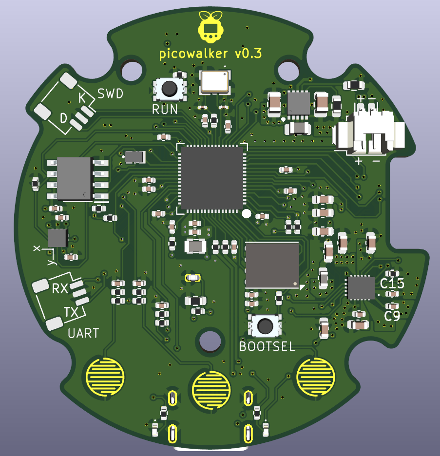

# picowalker hardware

This is the PCB hardware side of the [picowalker](https://github.com/mamba2410/picowalker) project.
The end goal is to create a new, modern equivalent to the Pokewalker distributed with the Pokemon HeartGold and SoulSilver games back in 2010.
Since those units are no longer sold and are getting harder and harder to obtain, creating a new version sounds like the easiest option. And the most fun.

This project has a little bit of history and messy organisation (see below) but this is the actively developed version of the hardware.

The hardware is designed around the rp2350 chip. STM32U5 versions have been considered for longer battery life, but they're more expensive and I'm worried about availability (and the name "picowalker" wouldn't work!)

## Features

- rp2350
- 1.8" AMOLED screen DO0180FMST03, 448x368 resolution (running at 384x256 for 4x upscaling) driven by PIO'd QSPI (output only).
- Rechargeable lithum battery via USB-C using the BQ25628E PMIC.
- Larger form factor to accommodate larger screen and battery.
- Custom shell based on the original Pokewalker designed by Kamp.
- IrDA driven by PIO courtesy of Dmitry gr's PIO code.
- 64kB EEPROM using the M95512 chip (same as in the original walker).
- Code and extra image flash using 16MB W25Q128 or IS25WP128.
- Accelerometer with BMA400 (successor to the original Pokewalker's one).
- USB 1.1 connection for flexible communications.

## Current state (updated 2025-10-12)

Hardware v0.3 design revision has been well tested, and hardware v0.4 design is underway.
This revision focuses on manufacturability and ironing out small quirks.
If all goes well, v0.4 should turn into the v1.0 hardware version for users.

Here's a render of v0.3 board:

## Organisation Confusion

The project originally started out as trying to re-create the Pokewalker on a breadboard using the newly-released Raspberry Pi Pico, which gave the project its namesake.
The end goal was to essentially glue together premade modules and put them in a nice enclosure to have a Pokewalker that resembled a [minty pi]().

The project scope then grew and turned into trying to create a custom PCB with all of the modules on and have a more polished version.
Due to concerns about battery life and pin counts, we moved to using an STM32U535 chip instead, as this solved those problems as well as provided a QSPI interface for the screen.

Development stalled because I didn't have enough time to work on the project, and things like driving the screen and designing a decent way to power the project were proving difficult to me.
However the STM32 option was a little overkill since it had lots of peripherals that we did not need for the project, and the chips were much more expensive than the rp2040 chips.

With the release of the new Raspberry Pi Pico 2, lower power states were introduced, making using this in a super low-power handheld/wearable device more feasible.
It also introduced the HSTX peripheral which was a good substitute for QSPI as the screen doesn't need two-way communications.

This brings us to now, August 2024, with presumably 6 months to get a working prototype using a Pico 2 before then being able to produce a fully interated PCB.
